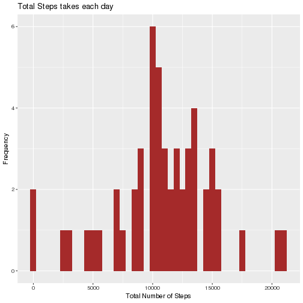
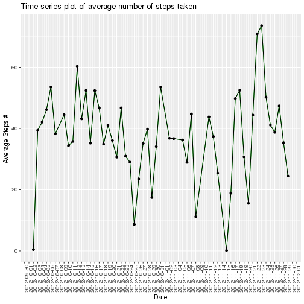
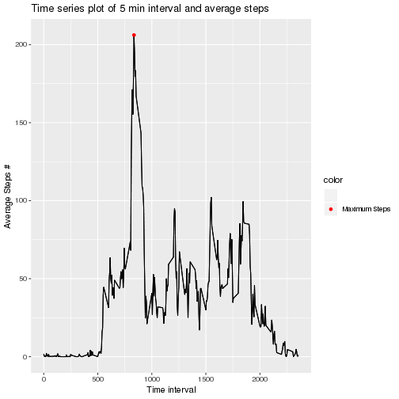
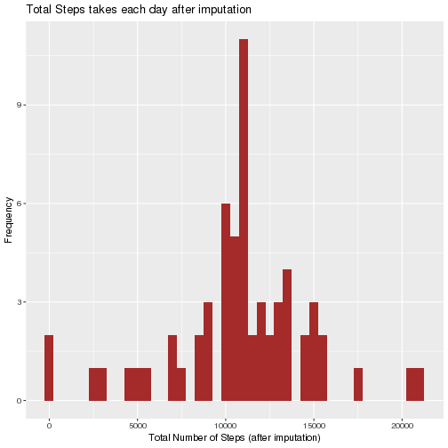

---
title: "Peer Assessment 1, Reproducible Research"
output: html_document
---


```r
 options(scipen = 1, digits = 2)
```

# Loading and preprocessing the data 

Data download from the web is loaded into a dataframe using 
fread from data.table package


```r
library(data.table)
library(dplyr)
library(ggplot2)
library(scales)
library(imputeMissings)
library(lattice)
library(Hmisc)
# Source URL : 
url = "https://d396qusza40orc.cloudfront.net/repdata%2Fdata%2Factivity.zip"
download.file(url,destfile="zipped_file.zip")
unzip(zipfile="zipped_file.zip")

input <- fread("activity.csv")

# Convert the values in the field "date" to actual Date format
input$date <- as.Date(input$date,format="%Y-%m-%d")
head(input)
```

```
##    steps       date interval
## 1:    NA 2012-10-01        0
## 2:    NA 2012-10-01        5
## 3:    NA 2012-10-01       10
## 4:    NA 2012-10-01       15
## 5:    NA 2012-10-01       20
## 6:    NA 2012-10-01       25
```

# What is mean total number of steps taken per day?

Missing values are ignored for this analysis.


```r
input_agg <- input[complete.cases(input), ] 
```

Total Number of steps per day is computed 


```r
input_agg <- input_agg %>%
  group_by(date) %>%
  summarise(steps = sum(steps)) 
```

Histogram of the total number of steps taken each day is plotted 

```r
ggplot(input_agg,aes(x=steps )) + geom_histogram(binwidth=500, fill="brown")  + ylab("Frequency") + xlab("Total Number of Steps")  + ggtitle("Total Steps takes each day")
```



Mean and Median of the total number of steps per day is calculated and reported 

```r
mean_steps <-  round(mean(input_agg$steps))
median_steps <-  round(median(input_agg$steps))
```

Mean of the Total number of steps per day is : 10766 .

Median of the Total number of steps per day is : 10765 .

# What is the average daily activity pattern?

Time series plot of the average number of steps taken

```r
input_avg <- input[complete.cases(input), ] 
input_avg <- input_avg %>%
  group_by(date) %>%
  summarise(steps = mean(steps, na.rm = TRUE)) 

 
ggplot(input_avg,aes(x=date,y=steps )) + geom_line(color="green") +geom_path(na.rm=TRUE) + geom_point()+ ylab("Average Steps # ") + xlab("Date")  + scale_x_date(labels = date_format("%Y-%m-%d"), date_breaks = "1 days") + theme(axis.text.x=element_text(angle=90, hjust=1))+ ggtitle("Time series plot of average number of steps taken")
```



Time series plot of the 5-minute interval(x-axis) and the average number of steps taken,averaged across all days(y-axis)


```r
input_int <- input[complete.cases(input), ] 
input_int <- input_int %>%
  group_by(interval) %>%
  summarise(steps = mean(steps, na.rm = TRUE)) 
head(input_int)
```

```
## # A tibble: 6 x 2
##   interval  steps
##      <int>  <dbl>
## 1        0 1.72  
## 2        5 0.340 
## 3       10 0.132 
## 4       15 0.151 
## 5       20 0.0755
## 6       25 2.09
```

```r
m <- input_int %>%  
  mutate(color =(max(steps) == steps)) 
max_int <- m[m$color=="TRUE","interval"] 
 

ggplot(m,aes(x=interval,y=steps )) + geom_line() +geom_path(na.rm=TRUE) + geom_point(aes(color=color))+ ylab("Average Steps # ") + xlab("Time interval")  +  ggtitle("Time series plot of 5 min interval and average steps") +  
  scale_color_manual(values = c(NA, "red"), label=c("","Maximum Steps"))
```

```
## Warning: Removed 287 rows containing missing values (geom_point).
```


Interval with maxmium steps : 835 .


# Imputing missing values 

Check if the input file has missing values and then replace the missing values with mean of that variable as part of imputation


```r
# Understand the missing value pattern
 
input_missing_pre <- length(which(is.na(input$steps)))

# Convert interval to factor
input$interval <- as.factor(input$interval)

# Imput missing values 

input_fixed <- input
  
input_fixed$steps <-  with(input_fixed,impute(input_fixed$steps,mean) )
 
 
input_missing_post <- length(which(is.na(input_fixed$steps)))

# 7.Histogram of the total number of steps taken each day after missing values are imputed

input_fixed_agg <- input_fixed %>%
  group_by(date) %>%
  summarise(steps = sum(steps)) 
 
 
ggplot(input_fixed_agg,aes(x=steps )) + geom_histogram(binwidth=500, fill="brown")  + ylab("Frequency") + xlab("Total Number of Steps (after imputation)")  + ggtitle("Total Steps takes each day after imputation ")
```



```r
mean_steps_non_imputed <- round(mean(input_avg$steps,na.rm=TRUE))
mean_steps_imputed <- round(mean(input_fixed_agg$steps,na.rm=TRUE))

median_steps_non_imputed <- round(median(input_avg$steps,na.rm=TRUE))
median_steps_imputed <- round(median(input_fixed_agg$steps,na.rm=TRUE))

sum_steps_non_imputed <- round(sum(input$steps,na.rm=TRUE))
sum_steps_imputed <- round(sum(input_fixed_agg$steps,na.rm=TRUE))
```

 
Missing values before imputation :  2304        
Missing values after imputation :  0    
 
Median before imputation :  10766        
Median after imputation :  37 
 
Mean before imputation :  10766        
Mean after imputation :  37 

Total steps before Imputation : 5.71 &times; 10<sup>5</sup>   
Total steps after Imputation : 6.57 &times; 10<sup>5</sup>   

# Are there differences in activity patterns between weekdays and weekends?

Panel plot comparing the average number of steps taken per 5-minute interval across weekdays and weekends

```r
input_weekend <- input_fixed[weekdays(input_fixed$date) %in% c("Saturday","Sunday"),]

input_weekend$Day_Type <- "Weekend"

input_weekdays <- input_fixed[! weekdays(input_fixed$date) %in% c("Saturday","Sunday"),]
input_weekdays$Day_Type <- "Weekday"

input_fixed_1 <- rbind(input_weekend,input_weekdays)
 

input_fixed_1 <- input_fixed_1 %>%
  group_by(Day_Type,interval) %>%
  summarise(steps = mean(steps)) 
 

ggplot(input_fixed_1,aes(x=interval,y=steps,group=1 )) + geom_line()+  ylab("Average Steps # ") + xlab("5 minute Interval") +   facet_grid( Day_Type ~ .)   + ggtitle("Pattern comparison between weekdays and weekend ")
```



